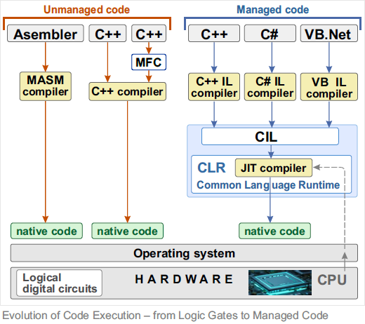

# Evolution of Code Execution – from Logic Gates to Managed Code

This project explores how software execution evolved:  
From physical logic circuits, through low-level programming, to high-level managed environments like .NET CLR.  
Understanding earlier stages helps grasp the internal logic of modern platforms.

## 🔗 Quick Navigation – Article Index

Back to <a href="https://github.com/janluksoft/Contents">menu</a>; 
Current <a href="https://github.com/janluksoft/NET_MainComparison">project</a>;

- <a href="https://github.com/janluksoft/InMemory_DigitalCircuits">Non-programmable digital circuits</a>;
- <a href="https://github.com/janluksoft/InMemory_Assembler">Direct CPU programming – assembler</a>;
- <a href="https://github.com/janluksoft/InMemory_PE_Format">High-level language C++ (PE format) </a>;
- .NET: <a href="https://github.com/janluksoft/NET_Types">Data types in .NET</a>;
- .NET: <a href="https://github.com/janluksoft/NET_ExecutionModel">.NET CLR execution model</a>;
- .NET: <a href="https://github.com/janluksoft/NET_CLR_RAM">Example of .NET application components placement in RAM via CLR</a>.
- .NET: <a href="https://github.com/janluksoft/NET_MemoryLeak">Memory leaks under C#</a>.

---

## Overview

The .NET framework offers powerful tools that simplify development. But this simplicity is built on deep, complex runtime mechanics – often invisible until problems arise.

In this article series, I go step-by-step from low-level foundations to advanced .NET internals.  
You’ll find original visualizations, memory snapshots, and breakdowns of runtime behavior – explained with precision and clarity.

---

## 📌 What's inside?

### 🔷 Historical layers of code execution:

- **Non-programmable logic circuits**  
  Hardware-built logic that solved problems before any CPU existed.

- **Direct CPU programming – assembler**  
  Raw instructions, full control, and close-to-metal debugging.

- **High-level language (C++, PE)**  
  Abstraction over machine code – compiled down, but developer-friendly.

---

### 🔷 Managed execution in .NET:

- **Data types in .NET**  
  What goes on stack, heap, and how types influence memory layout.

- **.NET CLR execution model**  
  How code gets compiled, interpreted, optimized, and executed.

- **RAM layout of .NET applications**  
  Full walkthrough of memory snapshot, with live memory mapping.

- **Memory leaks under C#**  
  Why garbage collection isn't a magic bullet – and how to catch leaks.

---

## Diagram example:

Below: one of the key diagrams used in this series.  
It shows the **transition from hardware logic to managed execution** – the foundation of modern software architecture.

 
Execution Diagram

---

## Final thoughts

This project grew out of personal exploration and professional need:  
I wanted to understand *how things really work*.  
If you find this series useful, feel free to star the repo or reach out with comments!

---

